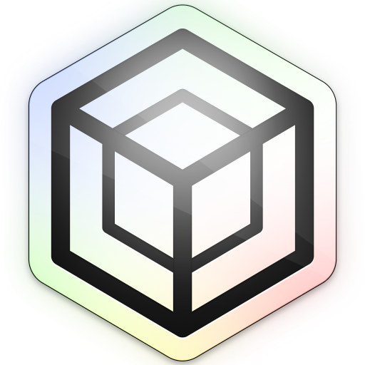

<p align="center">
  
</p>


<h1 align="center">Voxel</h1>

<p align="center">
  <strong>A complete open-source Roblox desktop experience</strong>
</p>

<p align="center">
<a href="https://github.com/6E6B/voxel/releases">
    
  </a>
  
  <a href="LICENSE"></a>
</p>

<p align="center">
  
  
  
  
</p>


> [!NOTE]
> Credentials are stored locally and never leave your machine. They are encrypted using Electron's safeStorage (OS-level credential storage) and optionally with an additional AES-256-GCM layer derived from your PIN.

## Features

**Launching**
* Multi-account management
* Multi-instance support
* Join via Place ID, Job ID, or Username
* Server region viewing
* Player & Studio version manager

**Avatar**
* 3D avatar editor
* Outfit management
* Inventory browser
* Accessory instance tree viewing

**Catalog & Economy**
* Catalog browser
* Transaction history
* Sales analytics
* Rolimons integration

**Social**
* Real-time friend presence
* Groups
* Quick join

**Tools**
* FFlags editor
* Asset downloader
* Activity logs
* Command palette (`Ctrl+K`)
* PIN lock
  
## Installation

Download the latest binary from [Releases](https://github.com/6E6B/voxel/releases).

| Platform | Filename |
| :--- | :--- |
| **Windows** | `voxel-x.x.x-setup.exe` |
| **macOS** | `voxel-x.x.x.dmg` |
| **Linux** | `voxel-x.x.x.AppImage` |

## Build from Source

**Prerequisites:** Node.js (v18+) and npm/pnpm.

```bash
# Clone
git clone https://github.com/6E6B/voxel.git
cd voxel

# Install
npm install

# Dev
npm run dev

# Build
npm run build:win   # or build:mac, build:linux